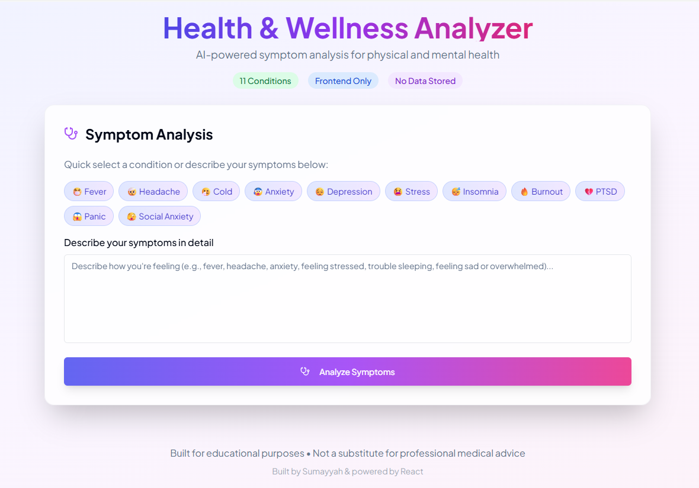
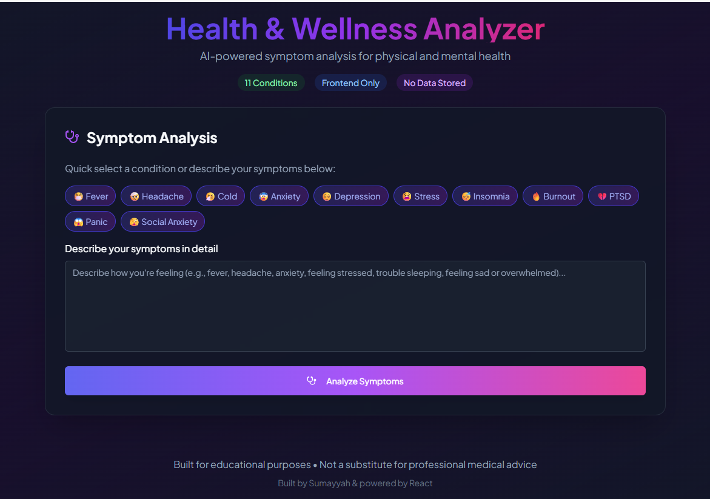
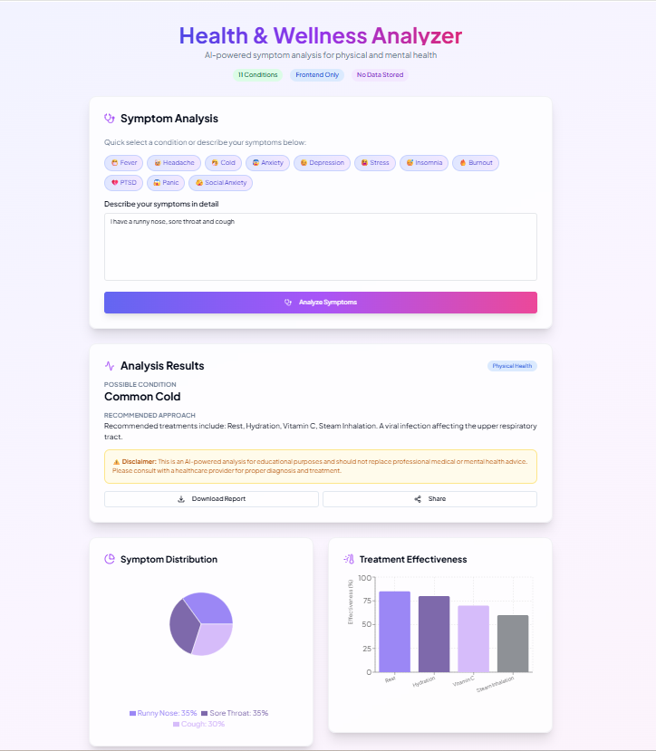

# 🩺 Medico‑AI — Patient Health Hub  
An AI-powered health assistant that helps users understand symptoms, explore possible conditions, and receive wellness guidance in a simple, friendly interface.  

Results include a **symptom chart** and **suggestion chart**, which can be downloaded or shared with others.

## Features  
- **AI Symptom Checker** – Users describe their symptoms in natural language and receive instant, AI-generated insights.  
- **Condition Explanations** – Clear, easy-to-understand medical information for better awareness.  
- **Wellness & Prevention Tips** – General guidance to support healthier daily habits.  
- **Clean & Responsive UI** – Designed for fast, accessible use on all devices.  

## Tech Stack  
- **Frontend:** HTML, CSS, JavaScript  
- **AI Integration:** API-based medical assistant  
- **Other Tools:** Git, GitHub, VS Code, React, Node.js  
- **Hosting:** Netlify  

## Disclaimer  
Medico‑AI provides general health information only. It is not a substitute for professional medical advice, diagnosis, or treatment.

## Live Demo  
Visit the app: [https://patienthealthhub.netlify.app](https://patienthealthhub.netlify.app)

## Screenshots  
  
  

